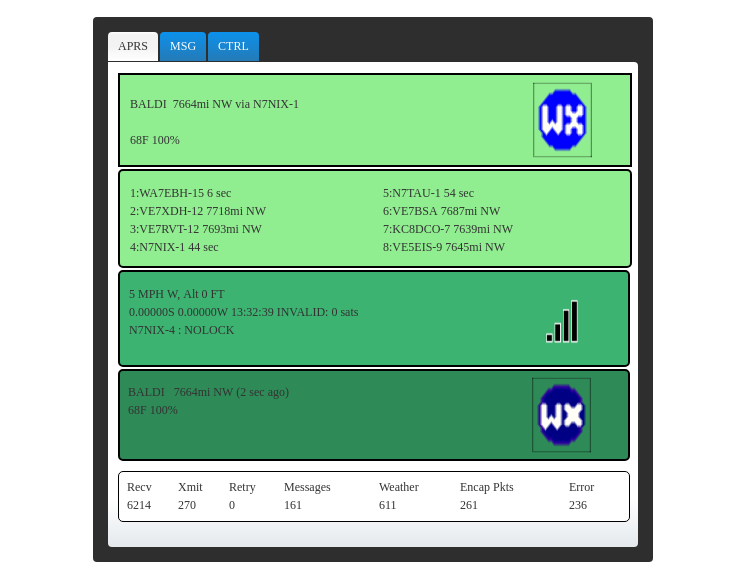
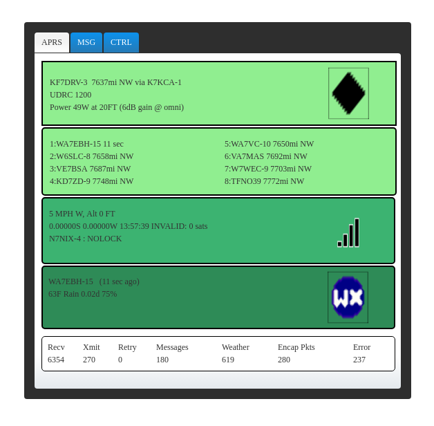

## dantracker

##### Basil Gunn N7NIX,  September 2017
* https://gitpitch.com/n7nix/dantracker

#HSLIDE

### History

* First entry in github/kk7ds repository March 6, 2011
* Forked from https://github.com/kk7ds/dantracker
  * First entry in github/n7nix/dantracker March 21, 2013

#### Authors
* Dan Smith KK7DS
* Basil Gunn N7NIX

#HSLIDE

### What is n7nix/dantracker, udrtracker, nixtracker, uat

#HSLIDE

#HSLIDE
#### References to original kk7ds/dantracker

* [My APRS Tracker Project Youtube](https://www.youtube.com/watch?v=JOaTdWAwdUQ)

* [A custom APRS tracker with a real screen](http://www.danplanet.com/blog/?s=a%20custom%20aprs%20tracker%20with%20a%20real%20screen)

#HSLIDE

### Differences between n7nix & kk7ds trackers

* kk7ds uses LCD display, GTK+
* n7nix uses browser, node.js
* Adds messaging & control screens
  * control screen: power down & halt or reset
* Version that controls paclink-unix

#HSLIDE

#HSLIDE

#HSLIDE

#HSLIDE
