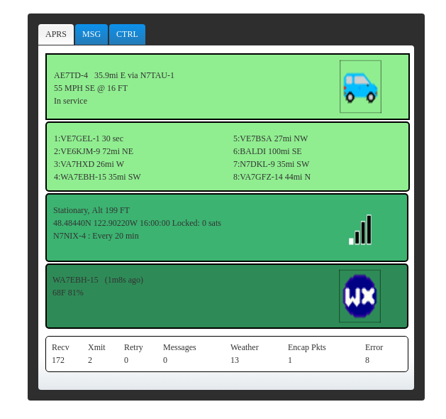

## dantracker

##### Basil Gunn N7NIX,  September 2017
* https://github.com/n7nix/dantracker

#HSLIDE

#### History

* First entry in github/kk7ds repo March 6, 2011
* Forked from https://github.com/kk7ds/dantracker
  * First entry in github/n7nix/dantracker March 21, 2013

#### Authors
* Dan Smith KK7DS
* Basil Gunn N7NIX

#HSLIDE

### What is n7nix/dantracker, udrtracker, nixtracker, uat

#HSLIDE


#HSLIDE

#### References to original kk7ds/dantracker

* [My APRS Tracker Project Youtube](https://www.youtube.com/watch?v=JOaTdWAwdUQ)
  * https://www.youtube.com/watch?v=JOaTdWAwdUQ

* [A custom APRS tracker with a real screen](http://www.danplanet.com/blog/?s=a%20custom%20aprs%20tracker%20with%20a%20real%20screen)
  * http://www.danplanet.com/blog/?s=a%20custom%20aprs%20tracker%20with%20a%20real%20screen

#HSLIDE

#### References to n7nix/dantracker

* [Eric Schott PA0ESH n7nix tracker on Ubuntu workstation](https://www.youtube.com/watch?v=Pg-buSHbZVc)

#HSLIDE

#### Features of dantracker
* Displays the following:
  * Received callsign & APRS icon
  * History of received callsigns heard
  * GPS & position status, beacon period
  * Digipeter quality bar graph
  * Telemetry
* When there is activity
  * Receive frame flashes green
  * Transmit beacon flashes GPS frame red
* Configurable Rotating beacon status messages


#HSLIDE

#### Differences between n7nix & kk7ds trackers

* kk7ds displays telemetry in the last panel
  * n7nix displays last weather beacon
* kk7ds uses LCD display, GTK+
  * n7nix uses browser, node.js
* Adds APRS messaging & control screens
  * control screen: power down & halt or reset
* Adds statistics display
* Parses encapsulated packets
* Version that controls paclink-unix
* Used valgrind to fix a number of memory leaks

#HSLIDE



#HSLIDE


#HSLIDE


#HSLIDE


#HSLIDE

#### Installation steps - provision sd card
* It's an RPi, put some Raspbian distro on a flash card
```
dd if=2017-08-18-compass.img of=/dev/sdc bs=1M
mount /dev/sdc1 /media/flash
cd /media/flash
touch ssh
cd
umount /dev/sdc1
```

#VSLIDE

#### Installation steps - initial boot
* boot sd card in an RPi and update files system
```
sudo su
apt-get update
apt-get upgrade -y
apt-get install git
# reboot
shutdown -r now
```

#VSLIDE

#### Installation steps - core
```
git clone https://github.com/nwdigitalradio/n7nix
```
* Installs direwolf & ax.25
```
cd n7nix/config
sudo su
./core_install.sh
./app_config.sh core
# reboot
shutdown -r now
```

#VSLIDE

#### Installation - optional: add user
```
sudo su
adduser <new_user>
usermod -aG adm,mail,dialout,sudo,audio,plugdev,users,input,netdev,gpio,i2c,spi <new_user>
su <new_user>
cd
rsync -av /home/pi/bin .
rsync -av /home/pi/n7nix .
```

#VSLIDE

#### Installation - core verification
```
tail -f /var/log/direwolf/direwolf.log
cd ~/bin
./ax25-status
./piver.sh
./sndcard.sh
netstat --ax25
listen -at
mheard
```
#VSLIDE

#### Installation steps - tracker
```
# Not root
cd n7nix/tracker
./tracker_install.sh
```
#VSLIDE

#### Installation steps - tracker
* Downloads & builds
  * libfap
  * libiniparser
  * json-c

* Downloads
  * jQuery
  * node.js
  * npm

#VSLIDE

#### Installation steps - iptables

* iptables to prevent mDNS multicast on AX.25 interface
  * Avahi broadcasts on all network interfaces
  * Apple zeroconf/bonjour


#HSLIDE

#### Run tracker

* tracker autostarts from systemd on boot

* Open a browser
```
# local
localhost:8081/tracker.html
# remote
your_RPi_IP_Adress:8081/tracker.html
```

#VSLIDE

#### Debug tracker - console

* Open a console

```
systemctl status tracker
```
```
# become root
screen -ls
```
```
There is a screen on:
	766.Tracker	(09/06/2017 11:09:29 AM)	(Detached)
1 Socket in /var/run/screen/S-root.
```
```
screen -x 766.Tracker
```

#VSLIDE

#### Debug tracker - browser

* In browser:
  * Click _Msg_ tab & look at _Enter Message_
  * Click _Ctrl_ tab & look at _Debug window_

#HSLIDE

#### This presentation

* https://gitpitch.com/n7nix/dantracker

#### Source repo

* https://github.com/n7nix/dantracker

#### Install repo

* https://github.com/nwdigitalradio/n7nix/tree/master/tracker